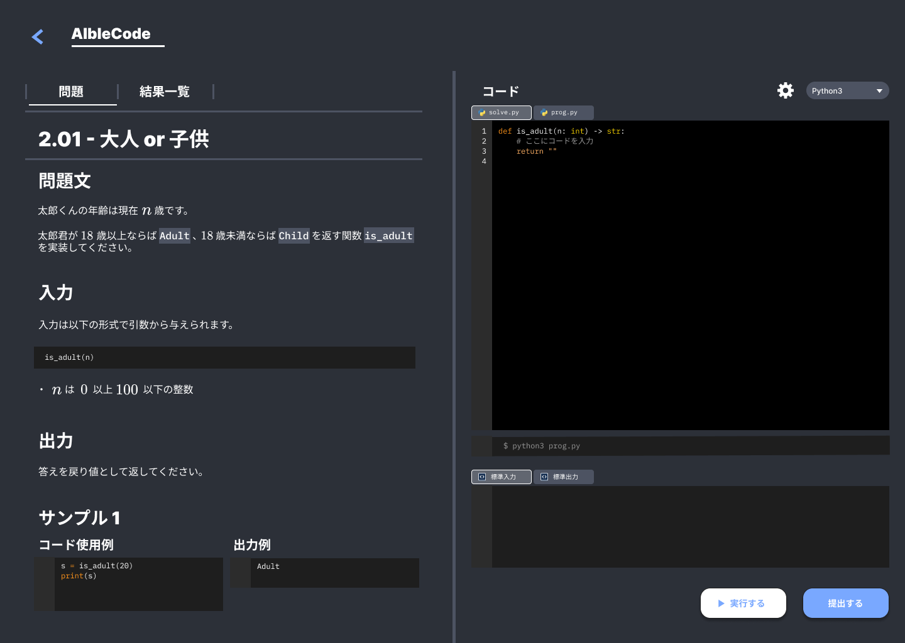
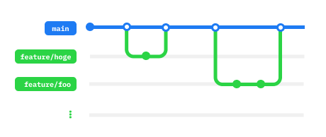

# AIbleCode

自動ジャッジ機能と生成AI技術を活用した、コードレビュー機能付きのプログラミング学習を行うWebサービスです。



## 技術スタック

#### フロントエンド技術

<p style="display: inline">
    
    
    
</p>

#### バックエンド技術

<p style="display: inline">
    
</p>

#### インフラ技術

<p style="display: inline">
    
</p>

## セットアップ

<!-- TODO: セットアップ方法を記述する -->

#### 開発環境で実行する
```bash
cd next-app
npm run dev
```

## ブランチ戦略
GitHub Flow に従ってブランチを管理する。

- **mainブランチ** （`main`）
  - 本番にデプロイするモジュールを作成するメインとなるブランチ

- **featureブランチ** （`feature/?`） 
  - 機能開発を行うブランチ
  - `main`ブランチから派生し、`release`ブランチのマージ時点で削除する
  - 最新の`main`ブランチから開発ができるよう、作業前には必ず`main`ブランチからプルする



**【参考記事】**
- Qiita : [GitHub Flowとは](https://qiita.com/tatane616/items/aec00cdc1b659761cf88)
- GitHub : [GitHubフロー](https://docs.github.com/ja/get-started/using-github/github-flow)

## 貢献ガイドライン

- 新しい機能は`feature`ブランチで開発してください。
- プルリクエストは小さい単位で出し、必ずコードレビューを受けてからマージします。

## ライセンス

本プロジェクトは **MIT License** の元で行います。詳細は [LICENSE](LICENSE) を参照してください。
